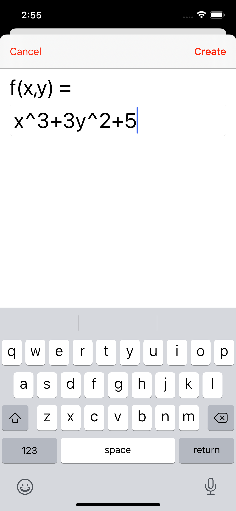
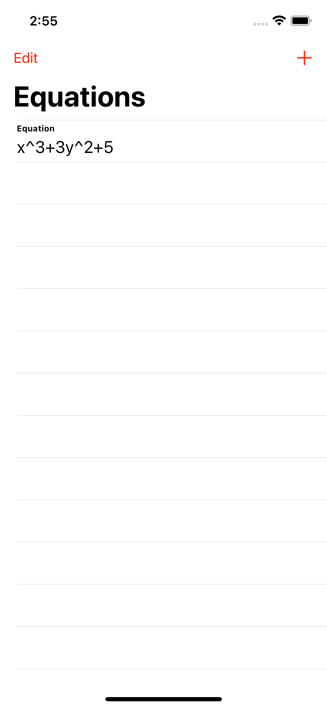
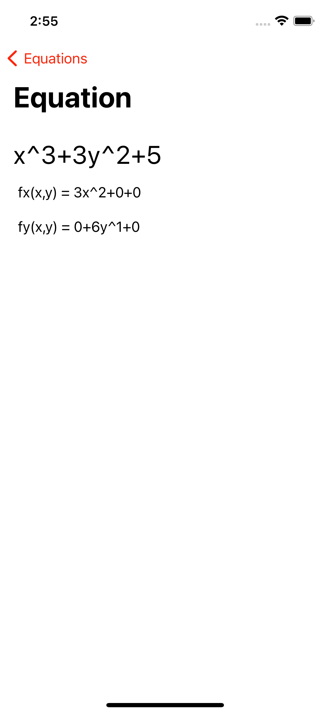
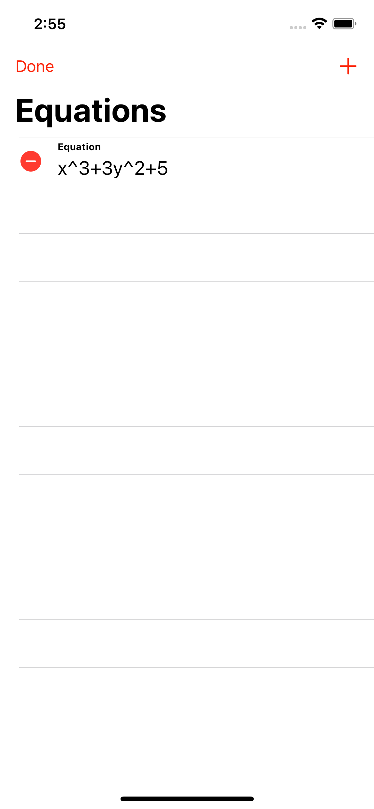

# Partial Derivatives iOS App 

This project was completed in Spring 2019, as an extra credit assignment for a Calculus III course.

The goal of this project is to generate simple partial derivatives given an equation. This would help college students in courses such as Calculus III to verify calculations.

Equations are stored in `UserDefaults`, so they persist even after the application is quit.

 
 

